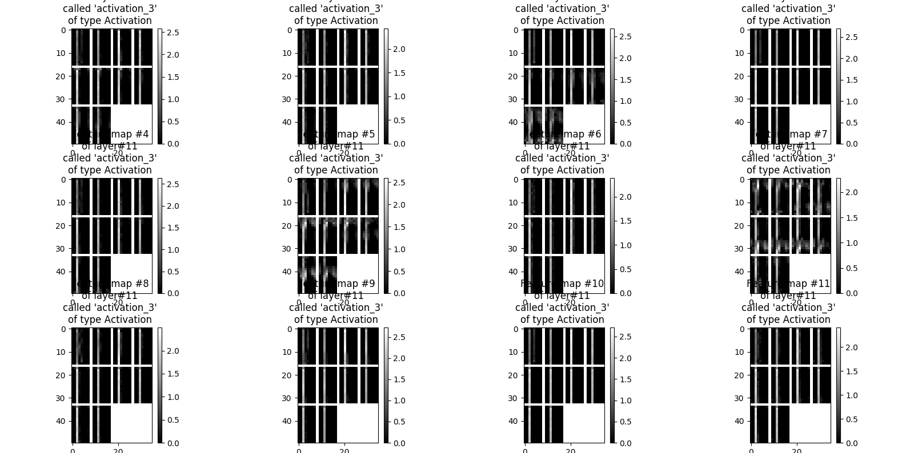
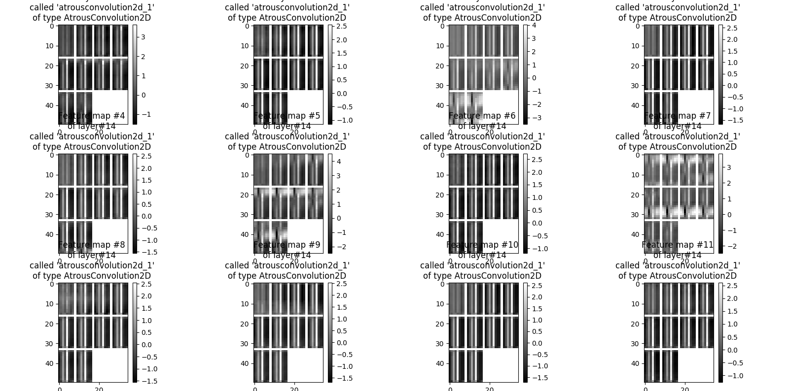

# Final Project in Deep Learning 
This is the final project in a deep learning course at Ben Gurion University.
In this project we had implemented a number of Architectures for Semantic Segmentation of cells from microscope images.

### Running the model
```
python mainScript.py --net-type='FCN' --plot-activations=true --plot-weights=false
```

the following command will run the Fully Convolutional architecture with plots of the activation functions.

The net types are the following:
- FCN
- EncoderDecoder
- ResNetFCN
- DeeperResNetFCN
- EncoderDecoderResNet 

### Some Nice Plots



